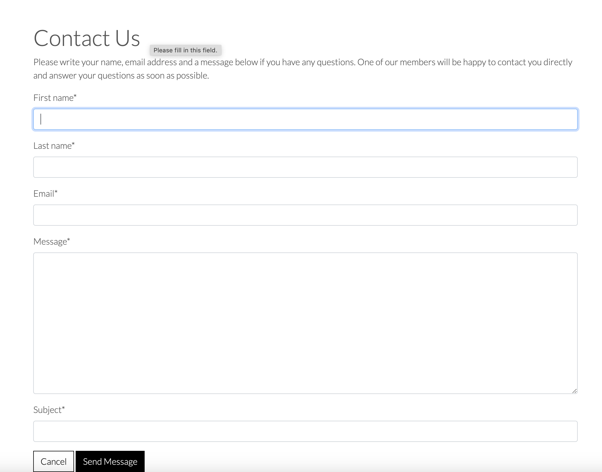
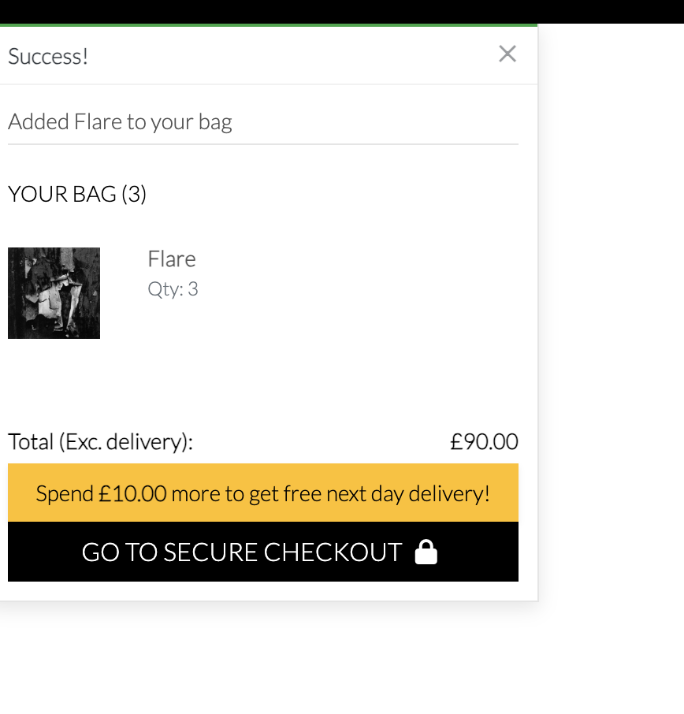

# Studio Gallery

Studio Gallery is a online store enabling the public to buy prints of artwork directly from the artists. They are able to search the site and see what art is currently available to purchase, and are able to purchase as many prints within certain limitations, paying with their card via Stripe functionality.

Users are also able to create a profile for faster purchasing and to see their previous orders.

## Table of Contents

- [UX](#ux)
- [Site User Goals](#site-user-goals)
- [Design Choices](#design-choices)
- [Wireframes](#wireframes)
- [Information Architecture](#information-architecture)
- [Future Goals](#future-goals)

- [Technology Used](#technology-used)

- [Testing](#testing)

- [Deployment](#deployment)

- [Credits](#credits)


## UX

**The Scenario**

Artists can find it difficult to have a regular income if they solely rely on large expensive pieces of work selling to a small audience who can afford to buy and have enough space to display works of art. 

In addition, if selling via a gallery, the gallery will take a commission – usually between 40 – 60% of the RRP of the piece, meaning an artist must consider this when pricing their work. This increases the overall cost of their piece, potentially shrinking their audience further.

If the artist has an agent for representation, they also tend to work on a commission basis and again, the artist must factor this in when pricing their work, although having a good agent can ensure the artist has new opportunities. 

Most artists who are not household names do not tend to be represented by galleries or agents, although they may show their work for a short term in a gallery space. Consequently, many artists must supplement their income with paid work, which can have an impact on the amount of time and energy available to create new pieces and promote their work to appeal to a wider audience.

**The Concept Solution**

Create a space online for artists to showcase their work directly to the public and enable the public to purchase print versions of the artists’ work.

Prints can be produced in different quantities, artists can choose to have them pre-printed prior to sales, as they may already have a stock of work ready to sell; or can choose to have an approach similar to print on demand with their preferred local print shop.

Prints can appeal to a wider market, who may not wish to invest in the original piece or who cannot afford to purchase one but would like to have a copy of the artwork they admire and also support the artist, much like the just a card initiative. (LINK)

A collective group of artists would appeal to a wider range of customers, rather than a single artist website, and costs of the site could be split across the group making it a cost effective way of being on a website without having to pay as much as if it was their own site, which would not receive as much traffic as a shared site.

Marketing costs could also be shared by the collective, and potentially the collective could work together to host real life events such as exhibitions, which they could use the website to drive footfall to the exhibition to increase sales, and also in a circular fashion, drive traffic to the website during the exhibition to increase sales and awareness of their collective work.

Whilst there are already a number of sites such as Etsy and Redbubble who showcase artists and provide a space for makers to sell their work directly, these are large sites and very often a consumer might say they bought it on Etsy, rather than the name of the artist or crafter who made the work in question. Within the selected group of artists on the site it would be easier to find a specific artist, rather than hunting across a much larger website with significantly more competition. 

**Target Audience Examples:**

Marsha and Chris, well-travelled early retirees who appreciate going away on a whim. The appreciate good wine, good books and good art. Marsha in particular loves sending things she finds beautiful to their wide circle of friends and has often recommended new and up-coming artists to her circle.

Katie – single, early thirties. She enjoys decorating her home with her own style, dislikes the current trend on colouring all spaces at home in grey. Likes unusual art and enjoys supporting artists when she can, does not have a large disposable income.

**Marketing:**

The main goal of the site is to assist artists to increase their income while reducing overheads associated with running a website where you can purchase products.

Having a shared site, allows the artists to promote themselves and each other, increasing the potential audience for their work, and as the site does not have a large number of artists, this improves the opportunities of the customer remembering the site and the artist name, meaning they are more likely to revisit in future and promote the site by word of mouth.

A Contact Us page ensures that the customer can communicate if needed with the artists, and the information about each artist, their practice and their pieces means the site has more interest than just a site which displays the work alone.

## Site User Goals

1. As a user I expect the site to be accessible
2. As a user I expect my purchases to be secure
3. As a user I expect the site to be responsive.

**Visitor Goals**

4.	As a visitor I want to be able to view all the art to see what’s available.
5.	As a visitor I want to be able to learn more about the artists and their work.
6.	As a visitor I want to be able to filter the work to see each artists' individual work.
7.	As a visitor I want to be able to sort the prints by price.

**Customer Goals**

8.	As a customer I want to be able to purchase more than one print of the same picture.
9.	As a customer I want to be able to have my own login.
10.	As a customer I want to be able to amend the items in my basket.
11.	As a customer I want to be able to remove items from my basket.
12.	As a customer I want to be able to pay by card.
13. As a customer I want to be able to use a contact page if I have a question.

**Artist Goals**

14.	As an artist I want to be able to display my work to the public and sell prints of it at a price I can set myself.
15.	As an artist I want there to be an account which enables an admin to log in and manage the site.
16.	As an artist I want there to be an account that is able to edit, create and delete work that is not accessible to customers.

I created a user story list in terms of priority, with all the goals in numerical order and then sorted in terms of priority.


Critical items were seen as essential, these are the secure purchasing, followed by accessible and responsive design. Card payments, superuser login, CRUD functionality, a contact page and the ability to see the prices of the products were listed as needed for the site. The ability to remove, amend and edit items in the basket, along with the option to see all products at were classed as wanted, and finally customer login, sort by price, filter by artist and a way to view information about the artist was seen as nice to have.

---

## Wireframes

Wireframes were used to create an idea of how the site should look on different devices.


User stories: [1](#site-user-goals), [3](#site-user-goals)

---

## Site Design

**Design Choices**

It was decided to keep the project as simple as possible, given this was the first time Django had been used. Ensuring things were kept as simple as possible meant that the focus could remain on the site as a whole. As the site is to display art in most appealing way, vivid colours were not used as these could easily detract from the work, and put off the consumer. 

The colour scheme was kept simple, with sticking to a white background with black text. Grey text was also used to give the site a slightly softer feeling.


Hex codes as follows: white: # ffffff, black: # 000000, grey: #555555

The site home page is colourful as it does not display any artist's work, but is a studio space. It was decided to have a colourful landing page as this was more enticing than having the artwork on the home page, and it meant that this could be a static image which could be updated when required, as opposed to featuring an image which might need to be changed at short notice if an artist no longer wished for their work to be displayed.


The image is of a working artist studio, hence it has equipment and supplies ready to use by the artist. Also gap in the wall close to the socket subtly shows the viewer that this is a place where creativity is allowed and the artist does not need to be too precious about their surroundings. This is not a posed image - this is a real studio.

---
**Mobile Version**


The mobile version of the site also shows the artist studio image, with the burger icon allowing the user to navigate around the site, ensuring the design is responsive.


The mobile version of the site enables the viewer to see the products in  a different row format to the larger screen versions of the site making the design reponsive.

User stories: [2](#site-user-goals), [3](#site-user-goals)

---

**Site Navigation**


Clicking on the all products drop down enables the visitor to the site to see all the products at once. There is also the option to use the filter drop down to sort by price and by artist.


Filtering products by artist (not logged in).


Sorting products by price (low to high), with user not logged in.


All artists page, with information about where the artist is from, and for some where they are currently based with tags to take the user to each artist’s filtered work.

User stories: [4](#site-user-goals), [5](#site-user-goals),  [6](#site-user-goals), [7](#site-user-goals) and [14](#site-user-goals)

---
**Contact Page**


Contact us page for customers to send queries or comments about the site directly to the site admin.

User stories: [13](#site-user-goals)

---
**Shopping on the Site**


Viewing the art and selecting more than 1 item.


Message confirming number of items successfully added to bag, with price and quantity, plus reminder about free shipping.


Bag quantity was 3 items, updated to 4 by using +quantity option and clicking update. Total price is updated and free delivery added as amount is over free delivery threshold.

User stories: [6](#site-user-goals), [7](#site-user-goals), [8](#site-user-goals), [10](#site-user-goals) and [11](#site-user-goals).

---

**Checkout Process**


Checkout option – not logged in.
Users can choose to pay without registering, as can be seen on the checkout page. There is an option to register their details. As the site uses Stripe for payment this meets the critical criteria of secure payments.


Notification success of purchase.
User stories: [2](#site-user-goals), [12](#site-user-goals)

---
**Registering for an Account**


Creating a new account page.
Customers can sign up to save their details. This includes a prompt for email verification which is required before accessing the site. 


Sign up verification notice – reminding new users to verify their email address.
User stories: [9](#site-user-goals),

---
**Ordering as a Registered User**


Order confirmation information for logged in user.


Logged in profile with saved address and previous order history.
User stories: [9](#site-user-goals)

---
**Using Site as a Superuser**


Filtering products by artist, with biography text underneath artist friendly tag (surname) for logged in superuser.


Adding product page with drop down list for selecting the artist for logged in superuser. 
User stories: [4](#site-user-goals),


Products page for logged in superuser to edit and delete items. Currently there is only a login to access all items, a later adaptation will ensure that it is only specific superusers who can edit and delete their own work. This is an option for future improvements.

User stories: [15](#site-user-goals) and [16](#site-user-goals)

---

### Information Architecture

**Product Data**

| Title            | Key In Database | Form Validation      | Data Type   |
|------------------|-----------------|----------------------|-------------|
| Product ID       | SKU             | No Validation        | Primary Key |
| Product Name     | name            | max_length 254       | Charfield   |
| Product_Artist   | artist          | Null true, blank true| Foreign Key |
| Price            | price           | decimal places 2     | Decimalfield|
| Image            | image           | Null True, blank True| ImageField  |
| Description      | description     | max_length 1000      | Charfield   |

**Product Artists Data**

| Title            | Key In Database | Form Validation      | Data Type   |
|------------------|-----------------|----------------------|-------------|
| Name             | name            | No Validation        | Primary Key |
| Friendly Name    | friendly_name   | max_length 254       | Charfield   |
| Identifier       | identifier      | max_length 5         | Charfield   |
| Biography        | biography       | max_length 1000      | Charfield   |

**Artist Data**

| Title            | Key In Database | Form Validation      | Data Type   |
|------------------|-----------------|----------------------|-------------|
| Name             | name            | max_length 254       | Primary Key |
| Image            | image           | Null true, blank true| ImageField  |
| Country          | country         | max_length 1000      | Charfield   |
| ProductArtist    | product_artist  | Null true, blank true| Foreign Key | 

**User Table**

|Title            |	Key In Database         |	Form Validation     |	Data Type     |
|-----------------|-------------------------|---------------------|---------------|
|Account ID       |	_id                     | No Validation       |	Primary Key   |
|First Name       |	first_name              |	max length 20       |	CharField     |
|Last Name        |	last_name               |	hashed min length 8 |	CharField     |
|E-mail Address   |	email                   |	Must contain @ etc	| Email         |
|Street Address   |	default_street_address1 |	max length 128      |	CharField     |
|Street Address 2 |	default_street_address2 |	max length 128      |	CharField     |
|City Or Town     |	default_city_town	max   | length 128          |	CharField     |
|County/State     |	default_county_state    |	max length 64       |	CharField     |
|Postal Code      |	default_postcode_zi     |	max length 12       |	CharField     |
|Contact Number   |	default_telephone_number|	Number max length 20|	CharField     |
|Country	        |country                  |	pycountry select    |	Option        |

**Orders Table**

|Title             |	Key In Database |	Form Validation     |	Data Type     |
|------------------|------------------|---------------------|---------------|          
|Order Number      |	order_number    |	No Validation       |	Primary Key   |         
|User Profile      |	user_profile    |	text                |	Foreign Key   |                 
|First Name        |	first_name      |	max length 100      |	CharField     |       
|Last Name         |	last_name       |	max length 100      |	CharField     |
|Email             |	email           |	max length 100      |	CharField     |
|telephone Number  |	telephone_number|	max length 20       |	CharField     |
|Street address 1  |	street_address1 |	max length 100      |	CharField     |
|Street address 2  |	street_address2 |	max length 100      |	CharField     |
|City Town         |	city_town       |	max length 100      |	CharField     |
|County/State      |	county_state    |	max length 100      |	CharField     |
|Postcode Zip      |	postcode_zip    |	max length 8	      | CharField     |
|Country           |	country         |	country select	    | Option        |
|Order Date        |	order_date      |	datetime.date.today |	DateField     |
|Total Order       |	total_order     |	max digits 10	      | DecimalField  |
|Delivery Charge   |	delivery_charge |	max digits 5        |	DecimalField  | 
|Grand total       |	grand_total     |	max digits 10       |	DecimalField  |

---

## Technology Used

* HTML
* CSS
* Javascript
* Python

## Tools

- [Fontawesome](https://fontawesome.com/icons)
- [Django](https://www.djangoproject.com/)
- [Am I Responsive](https://ui.dev/amiresponsive)
- [Balsamiq](https://balsamiq.com/)
- [Bootstrap](https://getbootstrap.com/)
- [Chrome dev tools](https://developer.chrome.com/docs/devtools/)
- [GitHub](https://github.com/)
- [Google Fonts](https://fonts.google.com/)
- [Heroku](https://heroku.com)
- [AWS](https://aws.amazon.com/)
- [ElephantSQL](https://www.elephantsql.com/)


Validation:
- [WC3 Validator](https://validator.w3.org/)
- [JShint](https://jshint.com/)
- [Lighthouse](https://www.webpagetest.org/lighthouse)
- [Wave Validator](https://wave.webaim.org/)

## Testing

Stipe functionality was added to the site, however any testing should use the below information, as the site is not set up to sell any of the art shown here.

| Card number         | 4242 4242 4242 4242 |
| Expiration date     | any future date    | 
| CVC                 | any three-digits    |
| Postcode or zipcode | any five-digits     | 

The project was tested during the process of creating it and errors were fixed along the way during the creation of the site. Here is a list of a number of the errors which were dealt with during the creation of Studio Gallery. 

---
* issue: url not linking correctly to contacts page.
* cause: url not correctly formatted.
* resolution: url updated, link working.
---
* issue: artist page not generating properly.
* cause: under investigation.
* resolution: temporary 'all artists biographies' page created as holding page until issue is discovered and resolved.
---
* issue: font is difficult to read on most pages.
* cause: Lato slim chosen as font, combined with text-muted, creating text that is difficult to see.
* resolution: text-muted replaced with text-black, Lato slim replaced with Lato regular.
---
* issue: artist model not working.
* cause: under investigation.
* resolution: amendment to model not successful - ongoing.
---
* contact page not sending emails.
* cause: fault caused by line not removed for default setting for emails in settings.py.
* resolution: settings.py updated - emails now successfully sending.
---
* issue: artist model still not updating correctly.
* cause: under investigation.
* resolution: delete migrations and re migrate model. Not successful - ongoing.
---
* issue: artist model still not updating correctly.
* cause: under investigation.
* resolution: temporary links added to temporary all artist biographies page to link to products while investigation is ongoing.
---
* issue: artist model not updating correctly.
* cause: under investigation - table not added correctly.
* resolution: delete dbsqlite3 and remake all migrations. Not successful - followed steps to step back to previous commit.
---
* issue: redeployment retains old database not current database and errors are occurring when amendments are made.
* cause: elephantsql retains original database and is not updating as it should.
* resolution: create new instance, loaddata to new database, site deployed successfully
---
* issue: site failing at deployment after redeployment.
* cause: answer found on stack overflow - backports info issue.
* resolution: add python_version<"3.9" to requirements.txt file
---
* issue: linking to products via all artist page not working on deployed site, but working on development site.
* cause: observation showed that deployed site converts link whereas development site does not.
* resolution: amend links to deployed site path for products filtering and note that dev site will not link correctly, but deployed site will.
---
* issue: users testing the site on mobile noted the artist biography was not responsive.
* cause: the formatting as not set up to be responsive for the text.
* resolution: removal of the box around the text, the text s now responsive and the site itself looks better.
  
# Deployment

1. Clone the Github repo to the desired location on your computer.
```
git clone git@github.com:rhih/studio_gallery.git
cd studio_gallery
 ```
2. Create and run a Python virtual environment in terminal.
```
python3 -m venv env
. env/bin/activate
```
3. Install the Python dependencies from `requirements.txt`.
```
pip3 install -r requirements.txt
```
5. Create an `env.py` based on the `sample-env.py` file.
   
1. Create and add a [Django secret key](https://django-secret-key-generator.netlify.app/).
2. If you'd like to test checkout payments, you'll need a [Stripe account](https://stripe.com/en-gb).
3. If you'd like to test newsletter functionality, you'll need a [Mailchimp account](https://mailchimp.com/).

7. Make migrations to prepare the database. This will create a `db.sqlite3` in the root. 
```
python3 manage.py makemigrations --dry-run
python3 manage.py migrate --plan
```
6. Create a new superuser.
```
python3 manage.py createsuperuser
```
7. Run the site locally.
```
python3 manage.py runserver
```

Deployment Requirements

- A [Heroku account](https://signup.heroku.com/).
- [Heroku CLI](https://devcenter.heroku.com/articles/heroku-cli#install-the-heroku-cli).
- An [AWS account](https://aws.amazon.com/).
- An [ElephantSQL account](https://www.elephantsql.com/)

For full functionality:

- A [Stripe account](https://stripe.com/en-gb) for the payment gateway.
- A [Gmail account](https://www.google.com/intl/en-GB/gmail/about/) for email SMTP.

- ElephantSQL:

- Sign up/Log in to ElephantSQL
- From the main ElephantSQL dashboard, navigate to the dropdown box in the top right and select 'Create New Instance'.
- Choose a name for your database and select a Plan type.
- In region, choose the most appropriate option and click 'Review'.
- On the next screen, click 'Create Database'.
- On the Instances screen, select the name of database you have just created.
- In 'Details', copy the URL. This will be needed for Heroku

## Deployment to Heroku

- In the development environment, make sure the requirements are up to date with `pip3 freeze --local > requirements.txt`.
- Also check that the `.gitignore` file lists everything that should not be pushed to production, such as `env.py`.

```
 Key	Value
```
AWS_ACCESS_KEY_ID	[your value]
AWS_SECRET_ACCESS_KEY	[your value]
SECRET_KEY	[your value]
DATABASE_URL [your value]
DEFAULT_FROM_EMAIL [your value]
EMAIL_HOST_PASS [your value]
EMAIL_HOST_USER [your value]
STRIPE_PUBLIC_KEY	[your value]
STRIPE_SECRET_KEY	[your value]
STRIPE_WH_SECRET [your value]
USE_AWS	TRUE


import os
```
os.environ["SECRET_KEY"] = "[Your Secret Key]"
os.environ["DEV"] = "1"
os.environ["HOSTNAME"] = "0.0.0.0"
os.environ["STRIPE_PUBLIC_KEY"] = "[Your Stripe Key]"
os.environ["STRIPE_SECRET_KEY"] = "[Your Stripe Secret Key]"
os.environ["DATABASE_URL"] = "[Your DB URL]"
```
Database Setup

To set up your database you will first need to run the following command. 
```
python3 manage.py migrate
```
To create a super user to allow you to access the admin panel run the following command in your terminal and complete the required information as prompted
```
python3 manage.py createsuperuser
```
From there you should now be able to run the server using the following command
```
python3 manage.py runserver
```
For deployment the following will be required:
```


AWS:
- Sign up/Log in to AWS
- Choose a name for your bucket and select the region closest to you from the dropdown box.
- Uncheck 'block all public access' and click 'create bucket'.
- Select 'static website hosting' and enable this to host your site.
- Enter index.html and error.html for the index and error documents.
- Set up AWS with necessary S3 bucket - ACLs enabled.
- Object Ownership should be Bucket owner preferred.
- On the properties tab, static website hosting can now be found by scrolling down to the bottom.
- Paste the following into the Cross-origin resource sharing (CORS) section.


```
python3 manage.py loaddata products/fixtures/products.json
python3 manage.py loaddata products/fixtures/product_artists.json
python3 manage.py loaddata artists/fixtures/artist_info.json
```

In Settings.py, ensure the following are at the top of your file.

from pathlib import Path
import os
import dj_database_url

In 'DATABASES' and comment out the default code and enter the following:

DATABASES = {
'default': dj_database_url.parse(os.environ.get('DATABASE_URL'))
} 
Replace the default 'SECRET KEY' with the following:

SECRET_KEY = os.environ.get('SECRET_KEY')

Run migrations for the new database using the command:

python3 manage.py makemigrations
python3 manage.py migrate

When it is deployed, you can launch the site via the link in Heroku.

# Future Goals

**Product growth options:

As the site currently only offers prints of artists' work, more options of the type of products could be available. This could vary between original pieces to canvas, textile and other products such as phone cases or notebooks could be printed with the art and shipped to the customer. This could be linked via services which already offer this business model, meaning the work could be sold globally and be created within the country/region to ensure shipping times and taxes would be kept to a minimum, whilst increasing the returns for the artists at a low cost.

**Site growth options:

In terms of what the site offers, increasing the number of artists, and artworks are the simplest way of growing the site.  Also improving search functionality to consider colour or theme as search options to increase the level of customer satisfaction. Adding in other options such as a sign up newsletter utilising a marketing automation platform such as Mailchimp, creating a featured artist of the month with an interview of the artist - perhaps including a short videoclip of them talking about their processes could help customer engagement. 

The site could offer artists stock management options, should artists wish to offer limited edition/one-off pieces, with higher costs. Different delivery options could also be offered as standard, especially for higher price point items, where insurance would be advisable. 


# Credits

**Media

Art images were sourced from [kaggle](https://www.kaggle.com/datasets "Link to Kaggle datasets")

Artist images were sourced from Google Images search.

Tyra Goodley https://www.artsyshark.com/2013/01/27/artists-at-work/
Andrew F https://natureinart.org.uk/artistinresidence/
Tom Werner https://www.liveabout.com/what-do-artists-do-1122810
Unnamed male artist by Unsplash https://www.shopify.com/blog/211990409-how-to-sell-art-online
Unnamed female artist by Gorodenkoff https://stock.adobe.com/images/talented-innovative-female-artist-draws-with-her-hands-on-the-large-canvas-using-fingers-she-creates-colorful-emotional-sensual-oil-painting-contemporary-painter-creating-abstract-modern-art/298117629
Unnamed Female standing in front of artwork 

All artist names, biographies, artwork names and descriptions are my own invention.

**Code 

This work was based on the Boutique Ado project by Code Institute, and references from 

Python
Django
Bootstrap


# Acknowledgements

A huge thank you to my mentor Richard without whom I would have not managed to submit anything. 

Communities on Slack and Stack Overflow were invaluable for assisting with technical problems. I consulted both regularly throughout the project.

A massive thank you to my colleagues, friends and family - who have cheered me on throughout my course. A special thanks to Hayley and Carrie for thoroughly testing my site.

All mistakes are very much my own.
